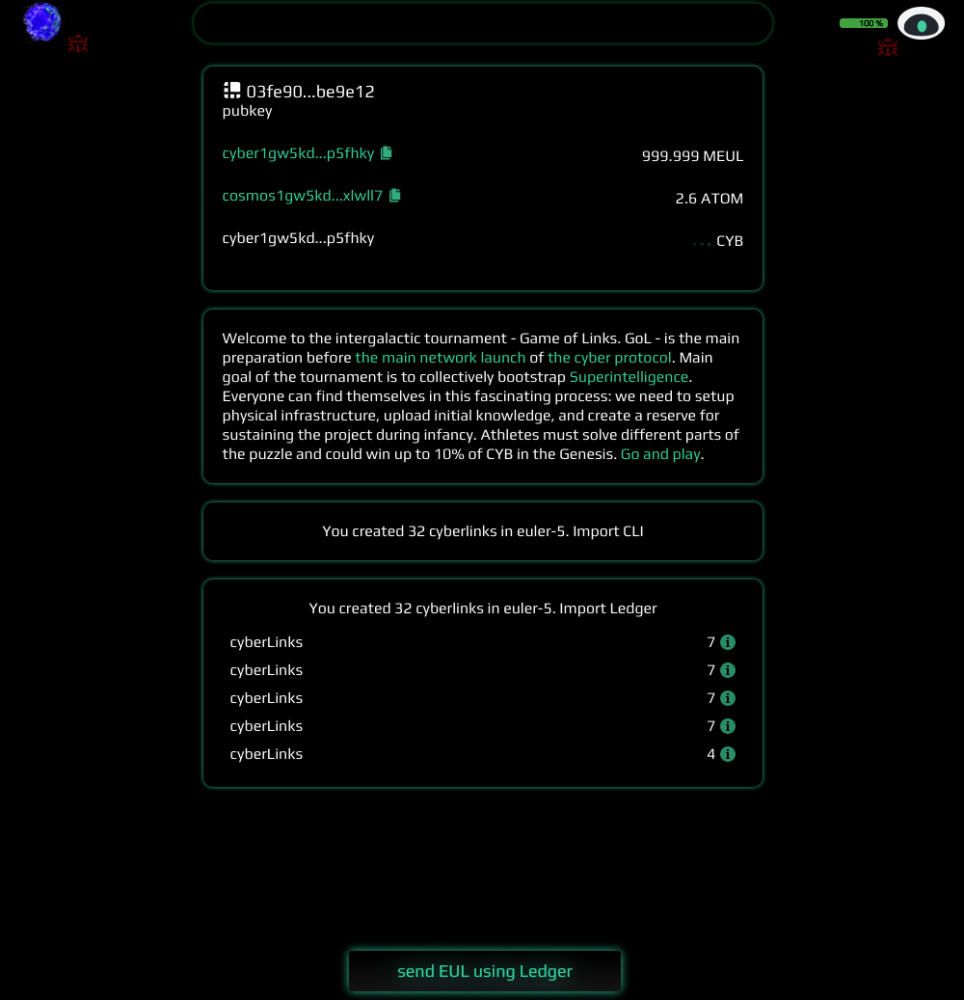
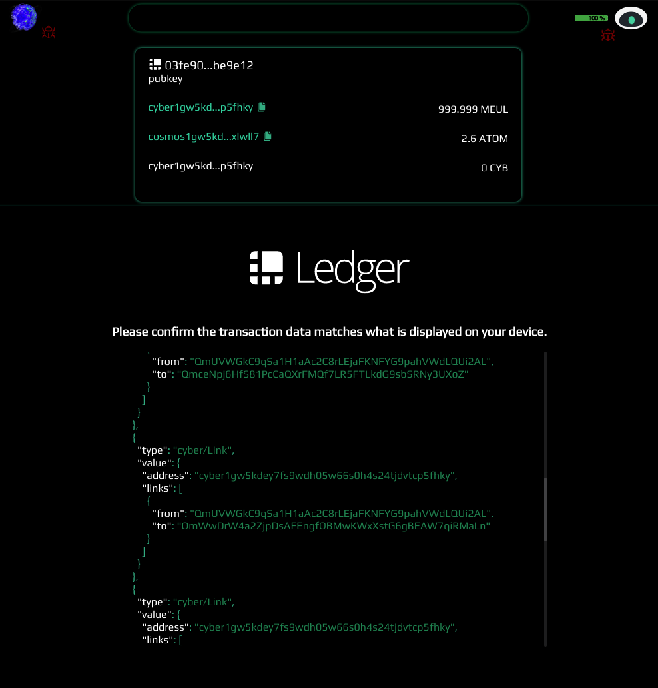
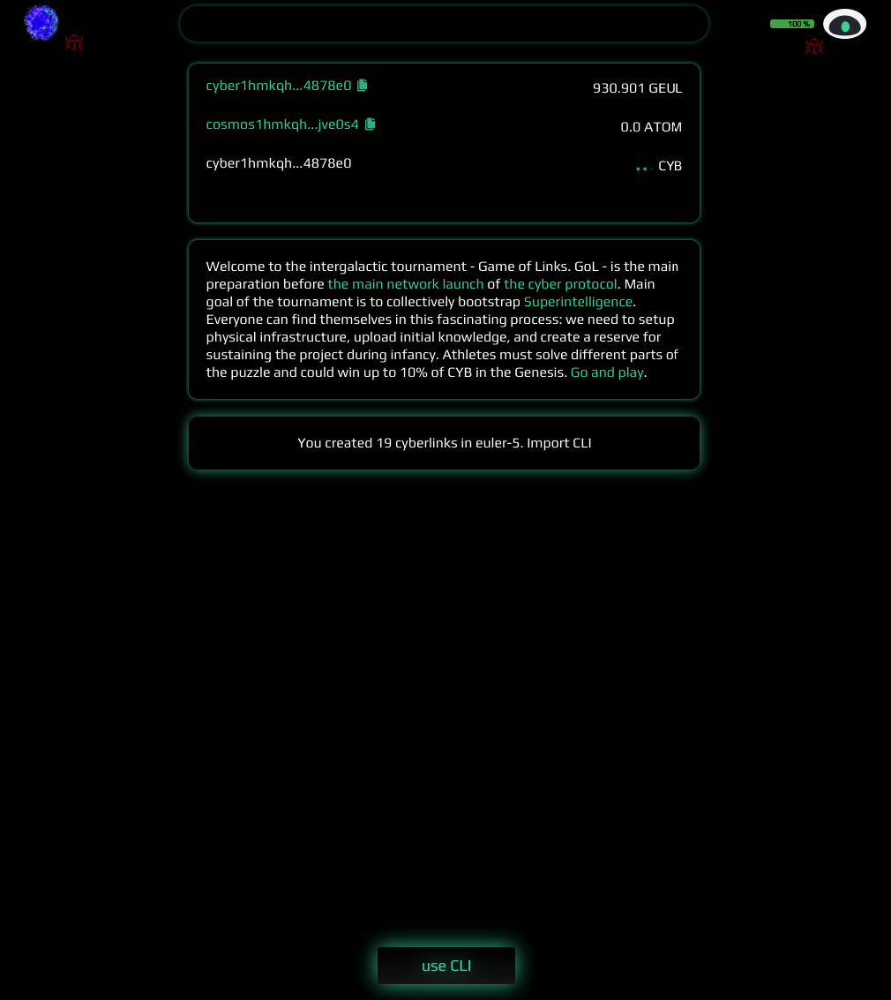

# How to import `euler-5` cyberlinks to `euler-6`

According to [migration proposal](), the [IPLD structure]() with all links by master had prepared. This is the tool for masters to migrate their links from `euler-5` to `euler-6` networks. This guide will explain several ways to cyberlinks migration.

## All my cyberlinks signed and broadcated by Ledger

Nice! Connect your Ledger device to cyber.page app pocket by clicking to the robot icon in the top right corner and pushing "put ledger" button. Ledger should be connected to the computer and the cosmos app in the ledger should be open:


After a successful connection, you should see your `cyber` and `cosmos` addresses of the connected account and the section with proposal to import cyberlinks using ledger:



Ledger's memory provides less or equal  7 messages in a cosmos transaction, so you need to make several transactions to import all links if they amount more than 7.


Click on the first cyberlink and push "sign" button to generate transaction:



Confirm the transaction data on your Ledger device. 

The same process you should make with other cyberlinks transactions if you have.

## All my cyberlinks signed and broadcated by CLI

In this case you should import your `cyber` address manual by clicking "pu only read address" button. 


You should see section "You created N cyberlinks in euler-5. Import cli"



Click on the section. The `tx_links.json` file should start to download. If not try to reload the page. 

Open the console and sign the transaction on file with your account

```bash
cyberdcli tx sign <PATH_TO_TX_LINK>/tx_links.json --from <account_name> --output-document <PATH_TO_TX_LINK>/tx_links_signed.json --chain-id euler-6
```

The output document is signed transaction ready for broadcast. Let send it to the network.

```bash
cyberdcli tx broadcast  <PATH_TO_TX_LINK>/tx_links_signed.json --chain-id euler-6
```

After transaction confirmed by the network you will see your `euler-5` links in the `euler-6` network.